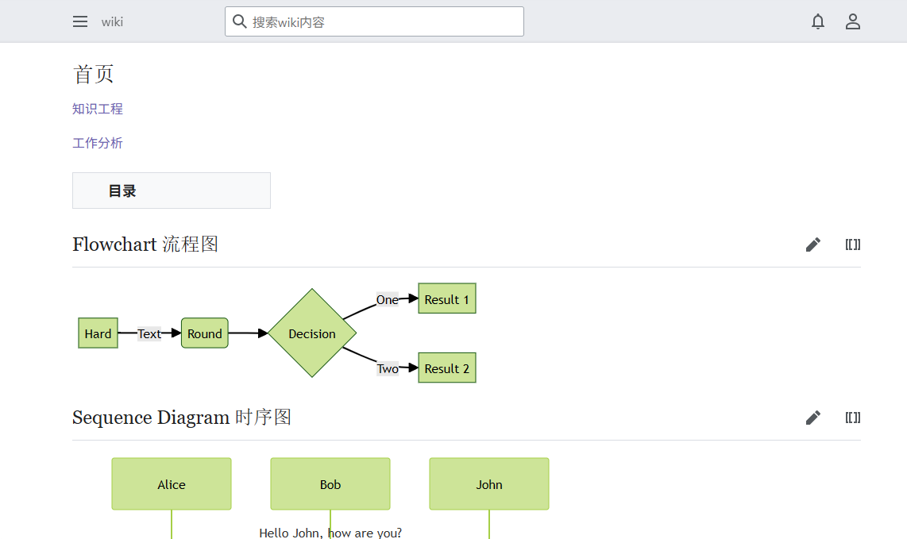

# mediawiki
https://www.mediawiki.org/wiki/MediaWiki-Docker/zh

https://www.semantic-mediawiki.org/wiki/Help:Installation/zh-hans

https://github.com/SemanticMediaWiki/Mermaid

https://www.mediawiki.org/wiki/API:RecentChanges

https://www.mediawiki.org/wiki/Extension:EventBus
* https://github.com/wikimedia/mediawiki-extensions-EventBus
* https://schema.wikimedia.org/#!/primary/jsonschema/mediawiki/page/change
<pre>
 
$wgScriptPath = '';
$wgArticlePath = '/w/$1';
$wgUsePathInfo = true;

# 自定义命名空间当前必须要有对应的讨论命名空间，为我添加的命名空间定义常量。
define("NS_JA", 3000); // 这必须是偶数。
define("NS_JA_TALK", 3001); // 这必须是下一个奇整数。
# 添加命名空间。
$wgExtraNamespaces[NS_JA] = "JA";
$wgExtraNamespaces[NS_JA_TALK] = "JA_talk"; # 请注意命名空间名称中的下划线
 
/var/lib/postgresql/18/docker/postgresql.conf

shared_preload_libraries = 'pg_stat_statements'
pg_stat_statements.track = all

/var/lib/postgresql/data

</pre>
 

# shawoo/semantic-media-wiki
<pre>
#在 LocalSettings.php 末尾追加两行（顺序不能反）：
wfLoadExtension( 'SemanticMediaWiki' );
enableSemantics( 'http://wiki.feg.cn' );   // 与 $wgServer 保持一致
$smwgNamespace = "http://wiki.feg.cn/index.php/Special:URIResolver/";
# 屏蔽所有 E_USER_DEPRECATED
error_reporting( E_ALL & ~E_USER_DEPRECATED );
ini_set( 'display_errors', 0 );

# root bash
docker exec -it -u root mediawiki-mediawiki-1 bash 
php maintenance/update.php --quick
</pre>
